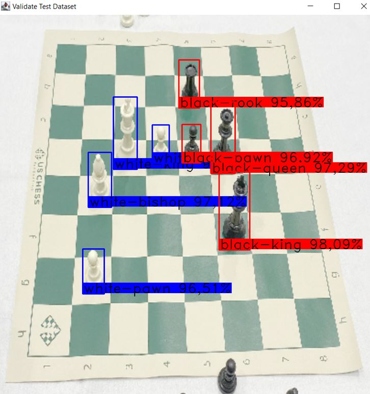
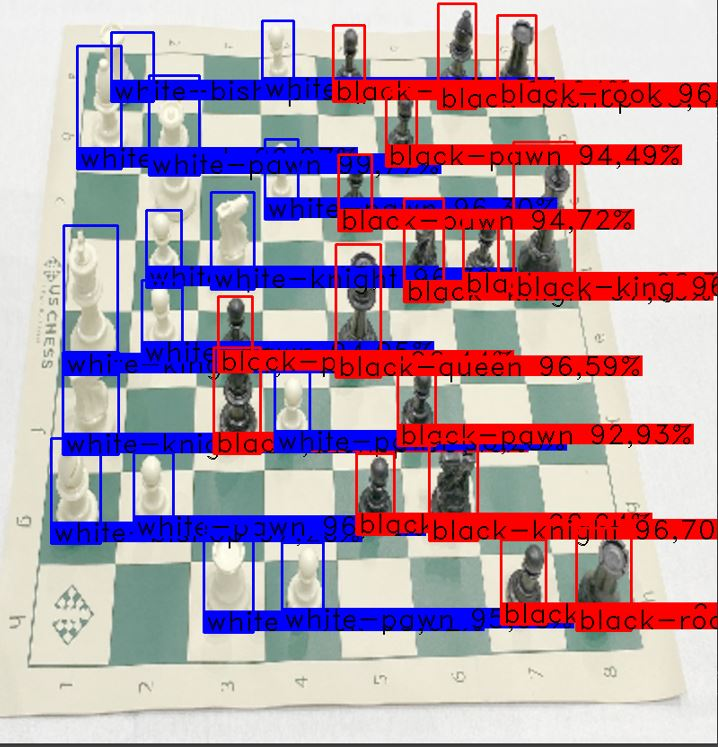
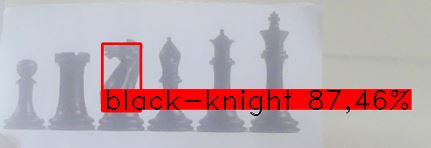

# Chess-detection-using-YOLOv2
<p align="center">
   <strong>Screenshots of the output</strong>
</p>
<p align="center">



</p>


This repository contains code for a object detector based on [YOLO9000: Better, Faster, Stronger](https://arxiv.org/pdf/1612.08242.pdf), implementeded using Deeplearning4J or DL4J. The code is based on codes of [Eclipse Deeplearning4j training lab](https://github.com/CertifaiAI/cdle-traininglabs). The program uses a pretained Yolo-v2 Model from DL4J zoo package. Model was trained on 239 images.

# Setup

## Before running the code (steps taken from cdle training labs)

### Install Java

Download Java JDK [here](https://www.oracle.com/java/technologies/javase/javase-jdk8-downloads.html).  
(Note: Use Java 8 for full support of DL4J operations)

Check the version of Java using: 
```sh
java -version
```

Make sure that 64-Bit version of Java is installed.

### Install IntelliJ IDEA Community Edition
Download and install [IntelliJ IDEA](https://www.jetbrains.com/idea/download/).

### Install Apache Maven
IntelliJ provides a default Maven that is bundled with the installer. Follow these [instructions](https://maven.apache.org/install.html) to install Apache Maven.

### GPU setup
Follow the instructions below if you plan to use GPU setup.
1. Install CUDA and cuDNN
    Requirements:
   -  CUDA 11.2
   -  cuDNN 8.1.1
  
CUDA and cuDNN can be downloaded from [here](https://developer.nvidia.com/cuda-11.2.0-download-archive) and [here](https://developer.nvidia.com/rdp/cudnn-archive). Step by step installation guides can be found [here](https://docs.nvidia.com/deeplearning/sdk/cudnn-install/index.html).

2. Dependencies are needed to be included into Maven project if we wish to use GPU for training. Follow the links below for instructions in details.
   - [ND4J backends for GPUs](https://deeplearning4j.konduit.ai/multi-project/explanation/configuration/backends#nd-4-j-backends-for-gpus-and-cpus)
   - [Using Deeplearning4J with cuDNN](https://deeplearning4j.konduit.ai/multi-project/explanation/configuration/backends/cudnn#using-cudnn-via-deeplearning-4-j)

## Parameters of Object detection
1. Anchor boxes: 8 anchor boxes
2. Classes: 12 classes (black king, black queen, black bishop, black knight, black rook, black pawn) and their white counterparts
3. updater: Adam's optimizer
4. transfer learning: Freeze the parameters (weights and biases) of the 5 first blocks in YOLOv2 achitecture
5. learning rate: 1e-4
6. Threshold: 0.6 (for detection), 0.5(NMS)
7. Number of epochs: 100
8. batch size: 2  (it is recommended to use a larger value if the hardware permits it (size of RAM AND GPU RAM))
## Contributing

Pull requests are welcome for fixing exisiting issues and/or adding any improvements.
